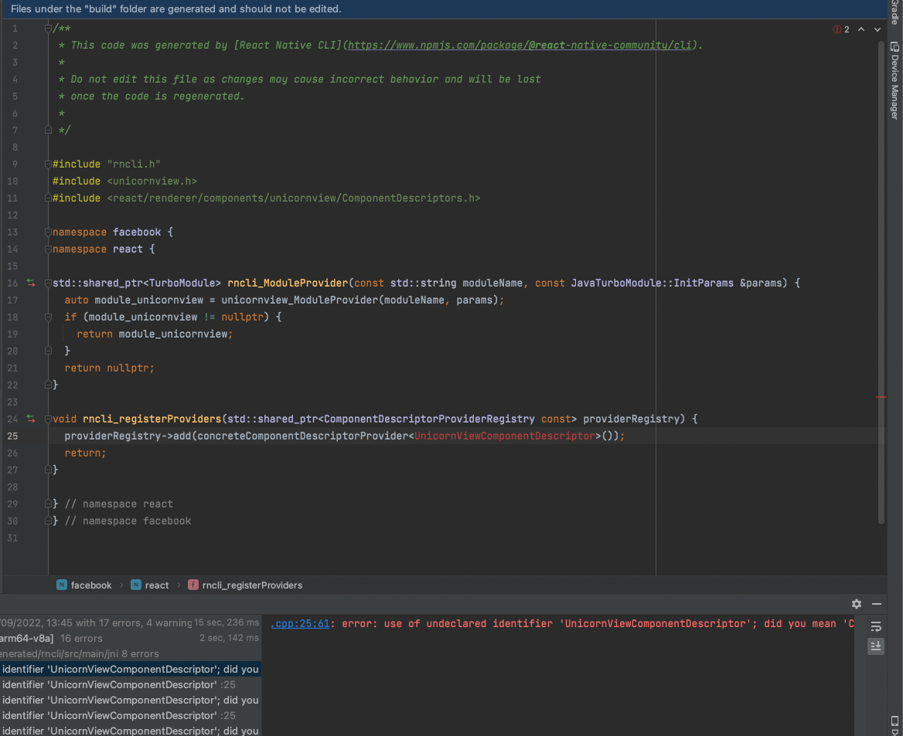
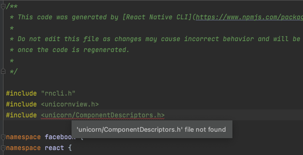

1. Create custom cpp [folder](https://github.com/troZee/react-native-cpp-autolinking/tree/main/cpp)
2. Add [CMake](https://github.com/troZee/react-native-cpp-autolinking/blob/main/cpp/CMakeLists.txt) to `cpp` dir
3. Add [CMake](https://github.com/troZee/react-native-cpp-autolinking/blob/main/android/CMakeLists.txt) file to `android` dir

Since the fact rn cli generates [header](https://github.com/react-native-community/cli/blob/main/packages/cli-platform-android/native_modules.gradle#L342) from build folder, this Component Descriptor is not visible for autolinking module

### Questions

- how to make custom cpp implementation visible for autolinking module ?

Even if I change import to reflect custom cpp name, it does not work too

